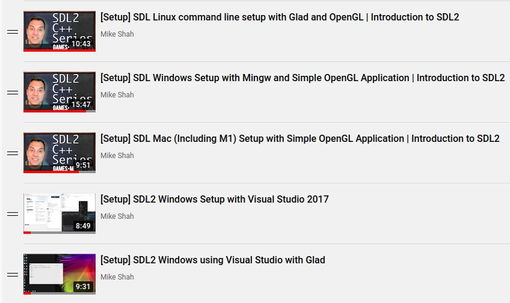

# Part 1 - OpenGL Setup

> We are going to test our environment for OpenGL, practice C++, and finally practice with git

## Implementation Logistics

- You may use whatever operating system, IDE, or tools for completing this lab/assignment.
	- However, my instructions will usually be using the command-line, and that is what I will most easily be able to assist you with.
- In the future there may be restrictions, so please review the logistics each time.

**For this Lab/Assignment**: You will be working on your own laptop/desktop machine. Historically, the setup is the most difficult part of the assignment, because supporting multiple architectures and operating systems can be tricky. Nevertheless, we will get through it!

# Resources to help

Some additional resources to help you through this lab assignment

| SDL2 related links                                    | Description                       |
| --------------------------------------------------    | --------------------------------- |
| [SDL API Wiki](https://wiki.libsdl.org/APIByCategory) | Useful guide to all things SDL2   |
| [My SDL Youtube Playlist](https://www.youtube.com/playlist?list=PLvv0ScY6vfd-p1gSnbQhY7vMe2rng0IL0) | My Guide for using SDL in video form.   |
| [Lazy Foo](http://lazyfoo.net/tutorials/SDL/)         | Great page with written tutorials for learning SDL2. Helpful setup tutorials for each platform. |
| [Lazy Foo - Handling Key Presses](https://lazyfoo.net/tutorials/SDL/04_key_presses/index.php) | Useful tutorial for learning how to handle key presses | 

| OpenGL related links                                | Description                       |
| --------------------------------------------------  | --------------------------------- |
| [My OpenGL Youtube Series](https://www.youtube.com/playlist?list=PLvv0ScY6vfd9zlZkIIqGDeG5TUWswkMox) | My video series for learning OpenGL |
| [docs.gl](http://docs.gl)                           | Excellent documentation to search for OpenGL commands with examples and description of function parameters   |
| [learnopengl.com](https://learnopengl.com)          | OpenGL 3.3+ related tutorial and main free written resource for the course   |

| C++ related links                                   | Description                       |
| --------------------------------------------------  | --------------------------------- |
| [My C++ Youtube Series](https://www.youtube.com/playlist?list=PLvv0ScY6vfd8j-tlhYVPYgiIyXduu6m-L) | My video series playlist for learning C++ |
| [cppreference](https://en.cppreference.com/w/)      | Definitive, more encyclopedic guide to C++ (less beginner focused, but excellent technically) |
| [cplusplus.com](http://www.cplusplus.com)           | Nice website with examples and tutorials geared more for beginners, reference has lots of examples, and the tutorial page is a great starting point |
| [learncpp.com](https://www.learncpp.com/)           | Handy page for learning C++ in tutorial form   |

# Description

The first task to becoming a graphics programmer, is to figure out how to configure your system to run graphics applications. Very likely you have written many console-based applications that run in a terminal or perhaps other environments (e.g. a web browser). I would like everyone to leave today understanding how to setup a graphics application and make sure they can move forward in this course when we begin creating and running hardware accelerated graphics applications.

Some specific goal(s):
1. How to compile and run the support code provided for an SDL applicaiton.

This support code, may also serve as a template for when you build your assignments (or personal projects) from scratch in the future.

## Task 1 - Simple DirectMedia Layer (SDL) (Reading ~2 minutes)

[SDL](https://www.libsdl.org/) ("Simple DirectMedia Layer") is a library that allows us to draw a window to the screen. We will be using SDL version 2.0+ for this course. SDL itself is an abstraction layer that can create windows for the appropriate platform(i.e. Windows, Mac, Linux, mobile, etc.), without us have to do the real nitty gritty details of setting up a window. While there are many libraries that exist to do this (e.g. SFML), we will be using SDL 2 in this course.

- A [Youtube playlist is provided to showcase how to program with SDL2](https://www.youtube.com/playlist?list=PLvv0ScY6vfd-p1gSnbQhY7vMe2rng0IL0) as well. (See image on right)
- If you want to know how to setup a window in your native operating system platform the long way (without using a library like SDL), here are some examples from the web: [Linux](https://vestackoverflow.com/questions/15091514/how-do-i-create-a-window-in-opengl-on-linux-instead-of-using-glut), [Linux X11](https://www.opengl.org/discussion_boards/showthread.php/177999-GCC-OpenGL-without-glut?p=1239444&viewfull=1#post1239444), [Graphics Context in Mac](https://developer.apple.com/library/content/documentation/GraphicsImaging/Conceptual/drawingwithquartz2d/dq_context/dq_context.html#//apple_ref/doc/uid/TP30001066-CH203-CJBDCHAC), [Native Windows](https://www.khronos.org/opengl/wiki/Creating_an_OpenGL_Context_(WGL))
  - (Note: It is always worth knowing how things work behind the scenes! In doing so however, you may further appreciate the work done by SDL for us!)
- We are not going to spend time arguing if other libraires (glut, freeglut, glfw, sfml, etc.) are the better.
  - Try the one that fits your need after we have learned the basics in this course.
  - I choose SDL2 because it is what modern commercial games use, it is free, and it supports many desktop environments (as well as mobile if you are interested!)

## Task 2 - More on OpenGL (Reading ~ 2 minutes)

Which version are we using for this course? The answer is that we will be using *at the least* version 4.1. I will try to push the course to use version 4.6 however, most Macs are capped at version 4.1.

**Note**: Mac users may be limited to OpenGL 4.1 and have to edit [./src/SDLGraphicsProgram.cpp](./src/SDLGraphicsProgram.cpp) (around line 93, the MAJOR and MINOR version to 4 and 1 respectively)

- There is some confusion as to which version of OpenGL versions exist.
- A relatively detailed version of the OpenGL version history is [here](https://www.khronos.org/opengl/wiki/History_of_OpenGL).
	- OpenGL has a "Compatibility" Profile which contains all of the features of OpenGL (i.e. all of the old stuff is still available)
	- OpenGL has a "Core Profile" which includes only new features that have not been deprecated (i.e. all the old stuff is removed).
		- The core profile is the future (although most graphics systems support legacy features that are decades old.).
  		- The compatibility profile has the old "fixed pipeline" in OpenGL. The fixed function pipeline was actually quite nice for learning purposes, but a fixed pipeline is not efficient compared to the more modern programmable pipeline which we will study.
  		- A [Forward compatibility](https://www.khronos.org/opengl/wiki/OpenGL_Context#Forward_compatibility) graphics context, will enforce the removal of all deprecated featuers.

- OpenGL Specifications (If you'd like to see all the features of a specific version of OpenGL)
	- The specification for OpenGL 4.1 is located [here](https://www.khronos.org/registry/OpenGL/specs/gl/glspec41.core.pdf). Note this is not required reading by any means, but it is nice to know the spec exists, and this is something you might reference if you work at Intel, NVidia, AMD, etc.
	- The specification for OpenGL 4.3 is [here](https://www.khronos.org/registry/OpenGL/specs/gl/glspec43.core.pdf)
	- And here's version 4.6 ([spec](https://www.khronos.org/registry/OpenGL/specs/gl/glspec46.core.pdf)) for those on the state of the art (as of Oct. 22, 2019)

If you further want to understand the whole setup from scratch, I would recommend this [OpenGL Video](https://www.youtube.com/watch?v=wg4om77Drr0&list=PLvv0ScY6vfd9zlZkIIqGDeG5TUWswkMox&index=5);

## Task 3 - Code Walk

A brief code walk through part 1 and the support code.

**Watch here**: [part 1 Code walkthrough](https://youtu.be/UXnzwTR6iSE)

## Task 4 - Setting up your Environment for SDL and OpenGL

[Please follow the directions for how to build the assignment here](./HowToBuild.md)

### Task 5 - SDL (First programming task)

For task 5, we are going to utilize SDL to make our graphics application a little bit more interactive. 

Change the program such that:

- Pressing the <kbd>1</kbd> key draws a red background(i.e. `glClearColor (1.0f,0.0f,0.0f,1.0f)`).
- Pressing the <kbd>2</kbd> key draws a green background(i.e. `glClearColor (0.0f,1.0f,0.0f,1.0f)`).
- Pressing the <kbd>3</kbd> key draws a blue background(i.e. `glClearColor (0.0f,0.0f,1.0f,1.0f)`).

Notice that the [glClearColor](http://docs.gl/gl4/glClearColor) function is responsible for controlling the color, and there is a helper function `SDLGraphicsProgram::SetClearColor` to help you set the color. However, keep in mind that input is handled from within the 'Input' function in main. You are welcome to modify the program any way that you like throughout the semester, but this should be a relatively short task once you figure out the keyboard input. :)

A resource for performing [keyboard input with SDL is provided here from Lazy Foo](http://lazyfoo.net/tutorials/SDL/04_key_presses/index.php) or my [Tutorial on GetKeyboardState](https://www.youtube.com/watch?v=piEekEUqvKY)

**Note**: You can setup your assignment to either hold the key down to change the backround color (and then it otherwise reverts to another color), or just pressing the key one time will change the color.

# Submission/Deliverables

### Submission

- Commit all of your files to github, including any additional files you create.
- Do not commit any binary files unless told to do so.
- Do not commit any 'data' files generated when executing a binary.

### Deliverables

- Read tasks 1,2, and 3 are for your enrichment (no deliverable need be commited)
- Commit your source code to this repository with your changes for Task 5.
	- We should be able to execute your program by running [python3 build.py](./build.py) and executing **./prog** on our systems in order to get things graded.
  - (No need to ever commit binary/executable files to the repository)

# Going Further

What is that, you finished Early? Did you enjoy this lab/assignment? Here are some (optional) ways to further this assignment.

- Start looking at some C++ tutorials [here](./http://www.cplusplus.com/doc/tutorial/)
- Start writing some OpenGL 3.3 from here! https://learnopengl.com I imagine many will finish soon. This is now dedicated graphics time!
- Look at some SDL tutorials on the net.
- Look for OpenGL 4.1 tutorials on the net.

# F.A.Q. (Instructor Anticipated Questions)

1. Q: Can I learn some more SDL2 to add shapes to the screen?
	- A: Sure, go for it! If you make further modifications, that is great! Now is the time to be learning before the course accelerates too much!
2. Q: I'm on windows and nothing is showing up in my console.
	- A: Try adding: `-mwindows -mconsole ` to the command line.

# Found a bug?

If you found a mistake (big or small, including spelling mistakes) in this lab, kindly send me an e-mail. It is not seen as nitpicky, but appreciated! (Or rather, future generations of students will appreciate it!)

- Fun fact: The famous computer scientist Donald Knuth would pay folks one $2.56 for errors in his published works. [[source](https://en.wikipedia.org/wiki/Knuth_reward_check)]
- Unfortunately, there is no monetary reward in this course :)
