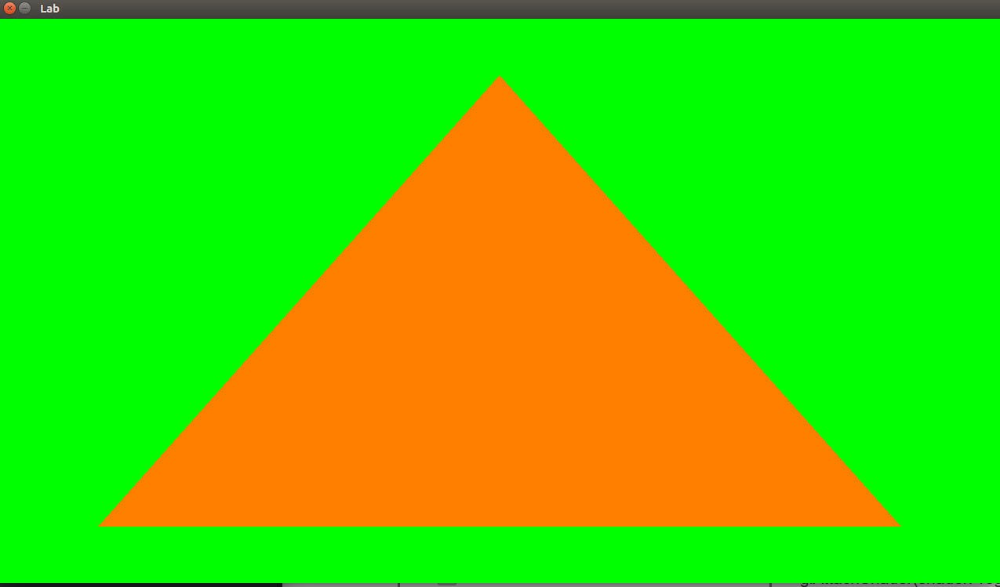
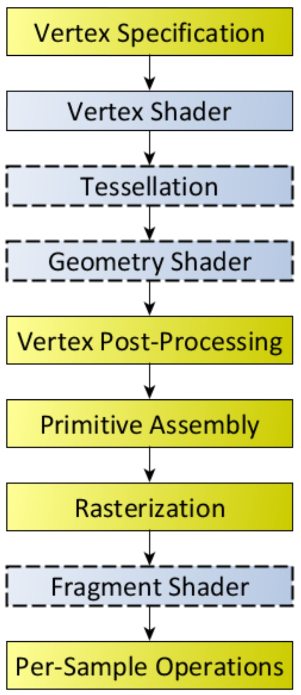
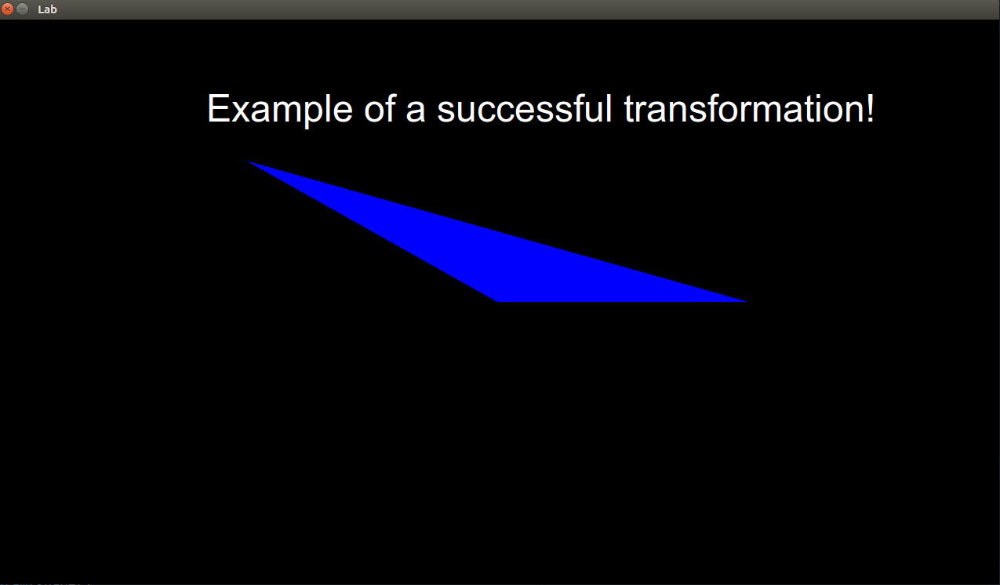

# First Shape (Triangle) 



> "Diving into OpenGL"

# Logistics

You will be working on your own laptop today.

# Resources to help

Some additional resources to help you through this lab/assignment

| SDL2 related links                                    | Description                       |
| --------------------------------------------------    | --------------------------------- |
| [SDL API Wiki](https://wiki.libsdl.org/APIByCategory) | Useful guide to all things SDL2   |
| [My SDL2 Youtube Playlist](https://www.youtube.com/playlist?list=PLvv0ScY6vfd-p1gSnbQhY7vMe2rng0IL0) | My Guide for using SDL2 in video form.   |
| [Lazy Foo](http://lazyfoo.net/tutorials/SDL/)         | Great page with written tutorials for learning SDL2. Helpful setup tutorials for each platform. |
| [Lazy Foo - Handling Key Presses](https://lazyfoo.net/tutorials/SDL/04_key_presses/index.php) | Useful tutorial for learning how to handle key presses | 

| OpenGL related links                                | Description                       |
| --------------------------------------------------  | --------------------------------- |
| [My OpenGL Youtube Series](https://www.youtube.com/playlist?list=PLvv0ScY6vfd9zlZkIIqGDeG5TUWswkMox) | My video series for learning OpenGL |
| [docs.gl](http://docs.gl)                           | Excellent documentation to search for OpenGL commands with examples and description of function parameters   |
| [learnopengl.com](https://learnopengl.com)          | OpenGL 3.3+ related tutorial and main free written resource for the course   |


| C++ related links                                   | Description                       |
| --------------------------------------------------  | --------------------------------- |
| [My C++ Youtube Series](https://www.youtube.com/playlist?list=PLvv0ScY6vfd8j-tlhYVPYgiIyXduu6m-L) | My video series playlist for learning C++ |
| [cppreference](https://en.cppreference.com/w/)      | Definitive, more encyclopedic guide to C++ (less beginner focused, but excellent technically) |
| [cplusplus.com](http://www.cplusplus.com)           | Nice website with examples and tutorials geared more for beginners, reference has lots of examples, and the tutorial page is a great starting point |
| [learncpp.com](https://www.learncpp.com/)           | Handy page for learning C++ in tutorial form   |


- Assignment related 
	- [Hello Triangle Tutorial](https://learnopengl.com/Getting-started/Hello-Triangle)
		- Useful tutorial to get you started understanding Vertex Buffer Objects(VBO)

# Description

Today we are going to create our first scene with OpenGL. We are going to build the fundamental primitive, and render a triangle! It takes a little bit of patience to get the first triangle up and running, but once we do -- we're ready to run on our graphics journey!

Your goal is to render:

- A smaller triangle than what is given (This requires decreasing some data values).
- A triangle of a different color (something other than orange)
- A background color different than green

## Task 0 - Setting up your Environment

For this part, you only need to run [python build.py](./build.py) to compile the source code from a terminal. If **g++** is not available, you may use clang++ instead.

## Task 1 - Programmable Graphics Pipeline



Recall that with Modern OpenGL we have a programmable pipeline. Part of that means that we have to implement at the least, a [vertex shader](https://www.khronos.org/opengl/wiki/Vertex_Shader) (which handles how individual vertices are positioned, colored, textured, etc.), and the [fragment shader](https://www.khronos.org/opengl/wiki/Fragment_Shader) (which handles how we rasterize a triangle).

In your next task, you will see the two shaders that are provided. The two shaders are compiled into binaries (i.e. executable programs) using the OpenGL API, and then sent to the GPU to execute the vertex and fragment portions of the graphics pipeline.

It's a little strange to think about, but all a shader is, is a little program that is compiled and executes part of the graphics pipeline based on your program that you write.

**Note:** In part 1 of this assignment you are going to see the shader source code stored as a string. Later on, you will see how a shader can be loaded as a file. Either strategy is fine, but the takeaway is that the shader is getting compiled when the program starts, and then we send that compiled shader to the GPU using the OpenGL API functions for creating and linking a shader program.

## Task 2 - Shaders at a glance

Take a look at the shaders in your program. See where they are stored, and what they are calling. Remembering what Shaders are, and think about what you need to modify (or rather, which of the two shaders you need to modify). 

Both shaders are here for your reference in case you want a fresh copy of either.

Shaders themselves can be written in many different languages before they are compiled, but for this course we will focus on using the [OpenGL Shading Language](https://www.khronos.org/opengl/wiki/OpenGL_Shading_Language) (GLSL).

### Example Vertex Shader

```glsl
// The version of the shader, 330 or 430 for example
#version 330 core

// The input that we are going to read in is from our vertex buffer object,
// and in this case, it will be the positions of our vertices.
in vec4 position;

// Entry point into our shader
void main()
{
	// gl_Position is a 'built-in' output variable in the GLSL language.
	// This means that after setting the gl_Position variable, the next
	// stage of the pipeline (i.e., the fragment shader) will read in
	// the values from gl_Position as a vec4.
    gl_Position = vec4(position.x, position.y, position.z, position.w);
};
```

### Example Fragment Shader

```glsl
// The version of the shader, 330 or 430 for example
#version 330 core

// The output of our fragment shader is going to be a color
// Note: Fragment shaders have exactly one output variable.
//       So we can name this whatever we want.
//       And if we look carefully at the graphics pipeline, we'll
//       notice that this is the final stage--thus it makes sense
//       that we have one final color to view.
out vec4 color;

// Entry point into our shader
void main()
{
      color = vec4(1.0f, 0.5f, 0.0f, 1.0f);
};
```

## Task 3 - Buffer Objects

Remember, a vertex buffer object is something that is storing some data and sent to the GPU. Think about what this means when attempting to solve today's task. [This tutorial](http://www.songho.ca/opengl/gl_vbo.html) provides a nice explanation of Vertex Buffer Objects (though the code is for a slightly older version of OpenGL).

# Submission/Deliverables

### Submission

- Commit all of your files to github, including any additional files you create.
- Do not commit any binary files unless told to do so.
- Do not commit any 'data' files generated when executing a binary.

### Deliverables

- A smaller triangle(than what is given) that renders in OpenGL.
- The modified triangle should have a different color.
- The background color should be different.



# F.A.Q. (Instructor Anticipated Questions)

1. N/A

# Going Further

What is that, you finished Early? Did you enjoy this lab/assignment? Here are some (optional) ways to further this assignment.

- Try to draw two triangles at once.
- Learn more about SDL in: [Game Development with SDL 2.0](https://www.youtube.com/watch?v=MeMPCSqQ-34)

# Found a bug?

If you found a mistake (big or small, including spelling mistakes) in this lab, kindly send me an e-mail. It is not seen as nitpicky, but appreciated! (Or rather, future generations of students will appreciate it!)

- Fun fact: The famous computer scientist Donald Knuth would pay folks one $2.56 for errors in his published works. [[source](https://en.wikipedia.org/wiki/Knuth_reward_check)]
- Unfortunately, there is no monetary reward in this course :)
