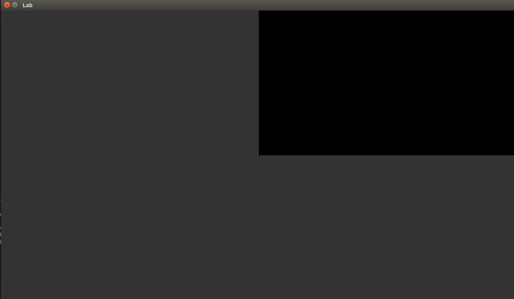

# Index Buffers

> "Rendering a triangles more efficiently by reuse"

# Logistics

You will be working on your own laptop today.

# Resources to Help

Some additional resources to help you through this lab assignment

| SDL2 related links                                    | Description                       |
| --------------------------------------------------    | --------------------------------- |
| [SDL API Wiki](https://wiki.libsdl.org/APIByCategory) | Useful guide to all things SDL2   |
| [My SDL2 Youtube Playlist](https://www.youtube.com/playlist?list=PLvv0ScY6vfd-p1gSnbQhY7vMe2rng0IL0) | My Guide for using SDL2 in video form.   |
| [Lazy Foo](http://lazyfoo.net/tutorials/SDL/)         | Great page with written tutorials for learning SDL2. Helpful setup tutorials for each platform. |
| [Lazy Foo - Handling Key Presses](https://lazyfoo.net/tutorials/SDL/04_key_presses/index.php) | Useful tutorial for learning how to handle key presses | 

| OpenGL related links                                | Description                       |
| --------------------------------------------------  | --------------------------------- |
| [My OpenGL Youtube Series](https://www.youtube.com/playlist?list=PLvv0ScY6vfd9zlZkIIqGDeG5TUWswkMox) | My video series for learning OpenGL |
| [docs.gl](http://docs.gl)                           | Excellent documentation to search for OpenGL commands with examples and description of function parameters   |
| [learnopengl.com](https://learnopengl.com)          | OpenGL 3.3+ related tutorial and main free written resource for the course   |

| C++ related links                                   | Description                       |
| --------------------------------------------------  | --------------------------------- |
| [My C++ Youtube Series](https://www.youtube.com/playlist?list=PLvv0ScY6vfd8j-tlhYVPYgiIyXduu6m-L) | My video series playlist for learning C++ |
| [cppreference](https://en.cppreference.com/w/)      | Definitive, more encyclopedic guide to C++ (less beginner focused, but excellent technically) |
| [cplusplus.com](http://www.cplusplus.com)           | Nice website with examples and tutorials geared more for beginners, reference has lots of examples, and the tutorial page is a great starting point |
| [learncpp.com](https://www.learncpp.com/)           | Handy page for learning C++ in tutorial form   |

- Assignment related 
	- [Hello Triangle Tutorial](https://learnopengl.com/Getting-started/Hello-Triangle)
		- Useful tutorial to get you started understanding Vertex Buffer Objects(VBO)
	- [songho tutorial on GL Vertex Array](http://www.songho.ca/opengl/gl_vertexarray.html)
	  - Tutorial on Vertex Arrays
	- [SDL API Wiki](https://wiki.libsdl.org/CategoryAPI)
	  - [SDL_Event](https://wiki.libsdl.org/SDL_Event) wikipage.
   - [[Episode 15] Rendering a Quad (And Understanding Winding Order) - Modern OpenGL](https://www.youtube.com/watch?v=QjmPjT-Iheg&list=PLvv0ScY6vfd9zlZkIIqGDeG5TUWswkMox&index=16)
   - [[Episode 16] Rendering a Quad Again! (More efficient Indexed-Buffer Strategy) - Modern OpenGL](https://www.youtube.com/watch?v=JUBBGRuf1CM&list=PLvv0ScY6vfd9zlZkIIqGDeG5TUWswkMox&index=17)

# Description

In the previous part, we rendered a triangle to the screen! There was a bit of setup code involved with SDL and OpenGL to prepare. As a recap:

* We had to initialize SDL and get window and OpenGL Graphics Context
* We had to setup a buffer that contained data for our vertices
* We had a minimal vertex and fragment shader that told OpenGL what to do with that data when we issue a glDraw* command (i.e. we built a graphics pipeline)
* Finally, we use [glDrawArrays](http://docs.gl/gl3/glDrawArrays) to output our data to the screen.

Next we want to render some data in a slightly more efficient way, using what is called an [Index Buffer](https://openglbook.com/chapter-3-index-buffer-objects-and-primitive-types.html). Index buffers allow us to select which vertex data we want to draw using indexes into a Vertex Buffer Object (VBO). You will also get some exposure to detecting keyboard input from a user with SDL.

## Task 1 - Setting up your Environment

For this part, you only need run [python build.py](./build.py) to compile the source code from a terminal. If **g++** is not available, you may use clang++.

## Task 2 - Index Buffers

You will find in the code "TODO" sections in the [./src/main.cpp](./src/main.cpp).

Today your goal is to render either a triangle or square based on a keypress:

- You will first need to make sure you have enough vertices to draw two triangles (i.e. exactly 4 vertices)
	- You will need to create an 'index buffer' (i.e. element array buffer).
- Draw a triangle or a square from the same vertex buffer object of data.
    - This means your draw command will draw a different number of indices for the desired shape.
    - Use of [SDL_Input](https://wiki.libsdl.org/APIByCategory#Input_Events) or SDL_GetKeyboardState() to press a key.
      - If a user presses the 'left arrow key' a triangle appears
      - If a user presses rhe 'right arrow key' a rectangle appears
      - Note: The triangle or rectangle should remain visible to the screen based on whether the left key or right key was last pressed.
      - Note: The initial shape you should show is the triangle when the application starts.

Note: Think about how you might want to implement this functionality -- it is okay if you make changes to the provided code.

# Submission/Deliverables

### Submission

- Commit all of your files to github, including any additional files you create.
- Do not commit any binary files unless told to do so.
- Do not commit any 'data' files generated when executing a binary.

### Deliverables

- A triangle or a square (using glDrawElements) depending on which indices are selected to render.
    - If a user presses 'left arrow key' a triangle appears
    - If a user presses 'right arrow key' a square appears
  

# F.A.Q. (Instructor Anticipated Questions)

1. Q: Can I modify the code to handle keypresses?
	- A: Yes you will have to. Consider adding some variable to store the state of the last key press, or otherwise to change the number of triangles you would like to render.

# Going Further

What is that, you finished Early? Did you enjoy this lab/assignment? Here are some (optional) ways to further this assignment.

- Add colors to your shapes! We will work on this next week, and figure out how to add attributes! Note that the provided shaders will work with color as is if you move ahead.

# Found a bug?

If you found a mistake (big or small, including spelling mistakes) in this lab, kindly send me an e-mail. It is not seen as nitpicky, but appreciated! (Or rather, future generations of students will appreciate it!)

- Fun fact: The famous computer scientist Donald Knuth would pay folks one $2.56 for errors in his published works. [[source](https://en.wikipedia.org/wiki/Knuth_reward_check)]
- Unfortunately, there is no monetary reward in this course :)
