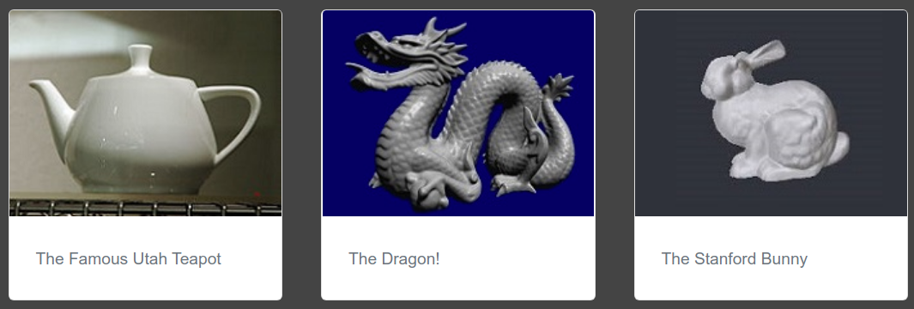

# Monorepo

- [ ] *Your Name Here*
  - **(TODO: Change this heading to your name, because your github name is often not your real name)**
- [ ] *[Phonetic spelling](https://dictionary.cambridge.org/us/help/phonetics.html) of your name here* **(TODO: Change this)**

## Important Documents 

- Please do not commit binary files unless asked in the repo (you may lose a point if you do)
- Read the FAQ
  - [Monorepo F.A.Q](./docs/faq.md) -- Answers questions like if you are allowed to share individual assignments(NO!), how to get an account, etc.
- The Token - Late Day Extension System
  - [Tokens Extension System](./docs/tokens.md) -- Answers questions about how to extend our assignment or lab to avoid late penalties.
- Tips
  -  [docs/Tips](./docs/Tips.md) -- Contains a few programming tips to keep in mind.
- How can I efficiently get help?
  -  [docs/Help](./docs/Help.md) -- Tips on how to help us, help you.
-  Creating a Personal Access Token (You'll likely need this when running **git pull**)
   - https://docs.github.com/en/authentication/keeping-your-account-and-data-secure/creating-a-personal-access-token

## Using the Monorepo to get help

One awesome thing about having all of your code in github, is that you can share a link to the course staff to specific source files when you need help. So when posting to piazza:

1. Share a link to your code (Don't worry, the repositories are private, so other students cannot access your code).
2. Make sure to push any changes made--anything you see online is what we will also see.
